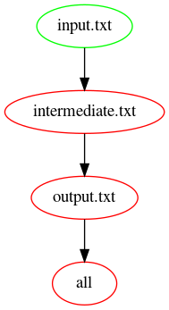

# travis_make_one_step

Branch   |[](https://travis-ci.org)
---------|----------------------------------------------------------------------------------------------------------------------------------------------------
`master` |[](https://travis-ci.org/richelbilderbeek/travis_make_one_step)
`develop`|[](https://travis-ci.org/richelbilderbeek/travis_make_one_step)

[Travis CI make example](https://github.com/richelbilderbeek/travis_make_tutorial)
of a pipeline of one step.

## Explanation



First, we specify in the `Makefile` that when we do `make`, the
success is dependent on `output.txt`:

```
all: output.txt
```

Second, we specify in the `Makefile` that `output.txt` is dependent on
`input.txt`. If `input.txt` changes, it will be copied to `output.txt`,
after which some text is appended. 

```
output.txt: input.txt
	cp input.txt output.txt
	echo "is cool" >> output.txt
```

## FAQ

### How did you make the picture?

Using `make pic` (also part of the `Makefile`),
which uses [lindenb/makefile2graph](https://github.com/lindenb/makefile2graph).

